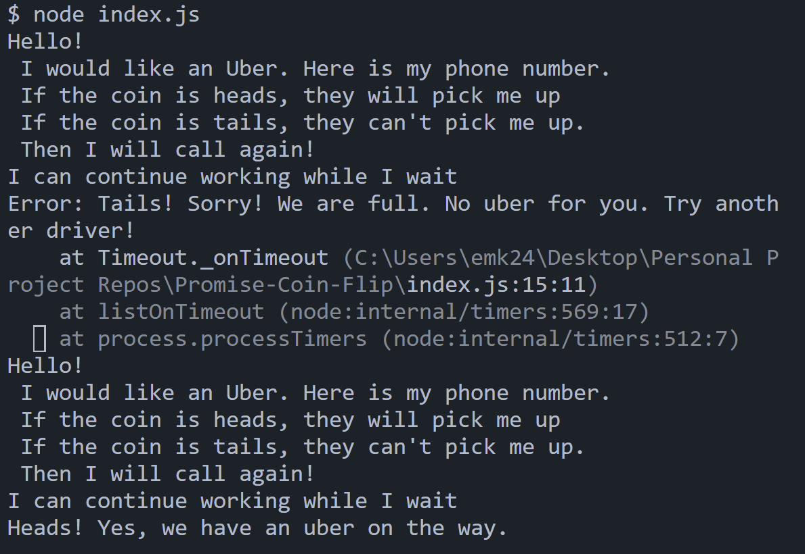

# Promise Coin Flip

 
Licensing: [mit](https://choosealicense.com/licenses/mit/)
    
## Table of Contents
  
- [Description](#description)
- [Installation](#installation-requirements)
- [Usage](#application-usage)
- [License](#licensing-information)
- [Contributions](#contributions)
- [Tests](#tests-commands)
- [Video Link](#link-to-video-instructions)
- [Screenshot](#screenshot)
- [Questions](#questions)
  
## Description
A demonstration of how 'promises' work using a coin flip and 'Uber' for the example.
  
## Installation Requirements
inquirer@8.2.4
  
## Application Usage
Use this application by reviewing the code and run the command line to visually see how a promise works. Promises are dependent on much more than a coin flip, but for this examples purposes we leave it to chance!
    
## Contributions
Eric Keeton
  
## Test Commands
node index.js
  
## Link to Video Instructions
n/a
  
## Screenshot

  
## Questions
For Questions, contact me at emk2473@gmail.com or visit My Github[EMK2473](https://github.com/EMK2473)
  
  